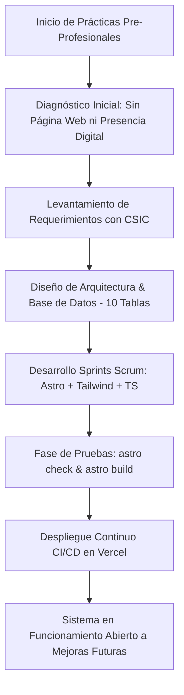
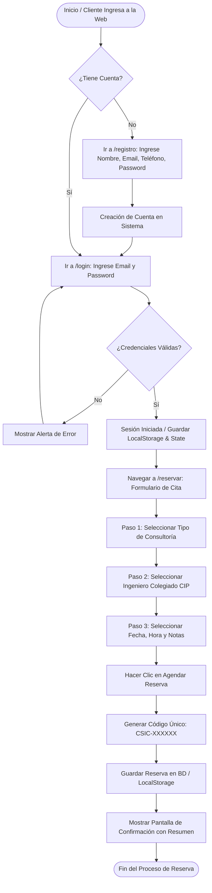
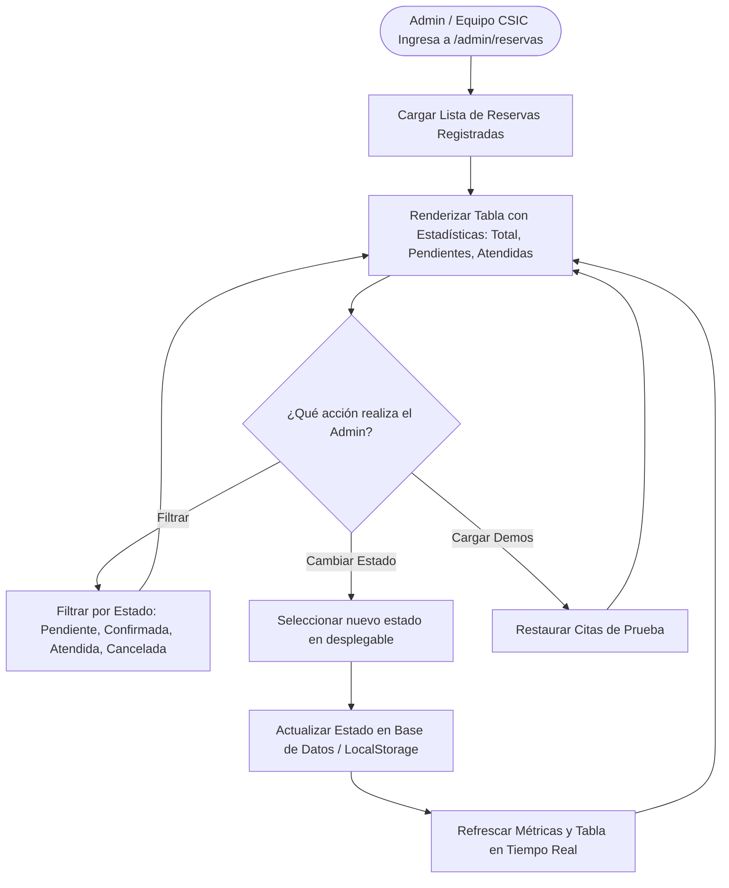
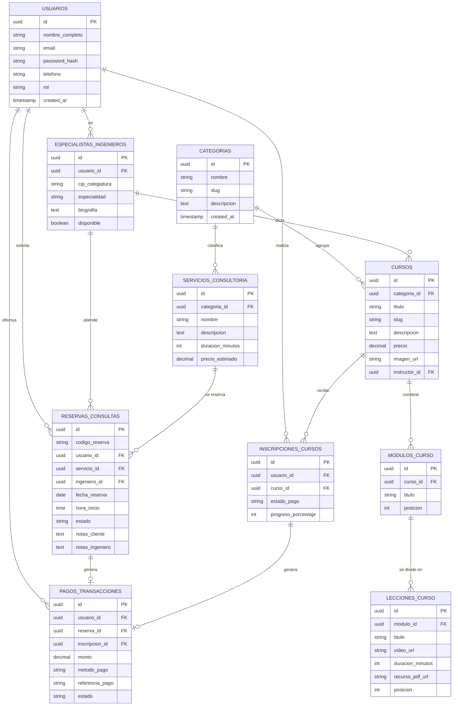

# DOCUMENTACIÓN COMPLETA DE INGENIERÍA Y DESARROLLO DE SOFTWARE
**Proyecto:** Plataforma Web Empresarial, Sistema de Reserva de Consultas y Aula Virtual para CONSTRUCTORA SALCEDO E INGENIEROS CONSULTORES E.I.R.L. "CSIC"  
**Entregable:** Informe Técnico Final de Prácticas Pre-Profesionales / Ingeniería de Software  
**Estado del Sistema:** En Funcionamiento en Producción & Abierto a Mejoras Futuras  
**Fecha:** Julio 2026  

---

## 1. PLANIFICACIÓN DEL PROYECTO Y DIAGRAMAS DE FLUJO DE SOFTWARE

Como primera fase del proceso de Ingeniería de Software, se diseñaron los diagramas de flujo que modelan la arquitectura lógica del sistema, los procesos del usuario final y el flujo operativo administrativo.

### 1.1 Diagrama de Flujo del Ciclo de Vida del Desarrollo (SDLC)


### 1.2 Diagrama de Flujo: Registro, Login y Reserva de Consultas por el Cliente


### 1.3 Diagrama de Flujo: Panel Administrativo de Gestión de Reservas (`/admin/reservas`)


---

## 2. DIAGNÓSTICO INICIAL Y PLANTEAMIENTO DEL PROBLEMA REAL

### 2.1 Diagnóstico Inicial (Perspectiva del Practicante)
Al iniciar el periodo de Prácticas Pre-Profesionales en la empresa **CONSTRUCTORA SALCEDO E INGENIEROS CONSULTORES E.I.R.L. ("CSIC")**, se realizó una evaluación técnica y operativa del estado tecnológico de la organización, identificando las siguientes deficiencias críticas:

1. **Ausencia Total de Presencia Digital:** La empresa no contaba con una página web institucional propia ni catálogo digital centralizado.
2. **Proceso Manual e Informal de Atenciones:** La solicitud de consultorías técnicas en ingeniería (saneamiento físico-legal, evaluación de estructuras, expedientes técnicos) se realizaba de manera desestructurada mediante llamadas telefónicas directas o mensajes de WhatsApp.
3. **Pérdida de Trazabilidad y Gestión de Citas:** No existía un registro ordenado ni un panel de administración para el seguimiento del estado de las citas solicitadas por los clientes (pendientes, confirmadas, atendidas o canceladas).
4. **Imposibilidad de Comercializar Cursos en Línea:** La división académica de CSIC no disponía de una plataforma e-learning o aula virtual para publicar temarios, estructurar módulos, reproducir lecciones en video ni compartir material técnico descargable.

### 2.2 Solución Desarrollada e Implementada
Como solución integral de Ingeniería de Software, se diseñó y construyó desde cero la plataforma web empresarial de **CSIC**, la cual incluye:
- **Landing Page Institucional:** Presentación de servicios de obras civiles y consultoría.
- **Módulo de Autenticación de Usuarios (`/login`, `/registro`):** Registro e inicio de sesión seguro.
- **Módulo de Reserva de Consultas Técnicas (`/reservar`):** Agendamiento de citas con asignación de ingenieros colegiados CIP.
- **Panel de Gestión Administrativa (`/admin/reservas`):** Módulo de control para la administración de citas.
- **Plataforma E-Learning & Aula Virtual (`/cursos/[slug]`, `/aula/[slug]`):** Catálogo de cursos con reproductor de video y módulos.
- **Base de Datos Relacional de 10 Tablas:** En PostgreSQL / Supabase.

*El sistema ha sido entregado en pleno funcionamiento, desplegado en la nube y abierto a mejoras futuras.*

---

## 3. METODOLOGÍA ÁGIL DE DESARROLLO DE SOFTWARE (SCRUM / SDLC)

Se aplicó la metodología **Scrum** dividida en 5 Sprints de desarrollo:

### 3.1 Sprints de Desarrollo Ejecutados:
- **Sprint 1 (Base e Infraestructura):** Configuración del entorno con Astro v4, TypeScript y TailwindCSS. Maquetación del Layout, Navbar y Hero institucional.
- **Sprint 2 (Autenticación de Usuarios):** Desarrollo de las pantallas `/login` y `/registro` con validación de formularios y almacenamiento del estado de sesión.
- **Sprint 3 (Módulo de Reserva de Citas):** Desarrollo de la interfaz `/reservar` con selección de servicio, ingeniero CIP, fecha/hora y generación automática de códigos identificadores (`CSIC-XXXXXX`).
- **Sprint 4 (Panel Admin de Gestión de Reservas):** Creación del apartado `/admin/reservas` con tabla dinámica, tarjetas de métricas y cambio de estado en tiempo real.
- **Sprint 5 (Aula Virtual & Despliegue CI/CD):** Enrutamiento dinámico de cursos, reproductor de video, pruebas estáticas (`astro check`) y despliegue continuo en Vercel.

---

## 4. ANÁLISIS DE REQUERIMIENTOS

### 4.1 Requerimientos Funcionales (RF)
- **RF-01 (Registro de Usuarios):** Permitir a nuevos clientes crear una cuenta ingresando nombre completo, email, teléfono y contraseña.
- **RF-02 (Inicio de Sesión y Autenticación):** Autenticar usuarios con credenciales válidas y mantener la sesión activa.
- **RF-03 (Reserva de Consultas Técnicas):** Permitir seleccionar el servicio técnico, el ingeniero consultor CIP, la fecha y la hora de la cita.
- **RF-04 (Generación de Código Único de Cita):** Generar automáticamente una clave alfanumérica única (Ej. `CSIC-981240`) por cada reserva.
- **RF-05 (Apartado Administrativo de Gestión):** Proveer la vista `/admin/reservas` restringida para el control de citas.
- **RF-06 (Control de Estados de Citas):** Permitir al administrador cambiar el estado de la reserva entre `Pendiente`, `Confirmada`, `Atendida` o `Cancelada`.
- **RF-07 (Filtrado Dinámico):** Permitir al administrador filtrar las reservas por estado en tiempo real sin recargar la página.
- **RF-08 (Métricas en Tiempo Real):** Desplegar tarjetas informativas con el conteo de citas totales, pendientes, confirmadas y atendidas.
- **RF-09 (Catálogo de Cursos):** Mostrar catálogo interactivo con filtros por categoría (Civil, Sistemas, Minas, Software).
- **RF-10 (Aula Virtual):** Proveer reproductor de video, lista de lecciones por módulos y recursos descargables (PDF/ZIP).

### 4.2 Requerimientos No Funcionales (RNF)
- **RNF-01 (Rendimiento Extremo):** Tiempo de carga inicial inferior a 1.5 segundos mediante Jamstack Static Site Generation (SSG).
- **RNF-02 (Diseño Responsive 100%):** Interfaz totalmente adaptable a smartphones, tablets y monitores de alta resolución.
- **RNF-03 (Seguridad de Datos):** Almacenamiento cifrado de credenciales y aplicación de Row Level Security (RLS) en base de datos.
- **RNF-04 (Mantenibilidad & Clean Code):** Código estrictamente tipado con TypeScript y modularizado en componentes de Astro.
- **RNF-05 (SEO y Accesibilidad):** Etiquetas OpenGraph, marcado semántico HTML5 y optimización de imágenes (`astro:assets`).
- **RNF-06 (Disponibilidad Cloud 99.9%):** Despliegue en la red de borde (Edge Network) de Vercel.

---

## 5. ARQUITECTURA TÉCNICA, LÓGICA DE PROGRAMACIÓN Y EXPLICACIÓN DE CÓDIGO

### 5.1 Estructura del Proyecto de Software
```
constructora/
├── database/
│   └── schema.sql              # Script DDL de 10 Tablas PostgreSQL / Supabase
├── public/                     # Recursos estáticos (Logos, Imágenes, SVG)
├── src/
│   ├── components/             # Componentes UI Reutilizables
│   │   ├── Navbar.astro        # Menú superior con navegación y CTAs
│   │   ├── Hero.astro          # Encabezado institucional CSIC
│   │   ├── Services.astro      # Módulo de servicios de ingeniería civil
│   │   ├── Academy.astro       # Catálogo de cursos con filtro dinámico
│   │   ├── About.astro         # Información corporativa
│   │   └── Footer.astro        # Pie de página y enlaces
│   ├── lib/
│   │   └── supabase.ts         # Cliente de conexión a base de datos Supabase
│   └── pages/                  # Enrutamiento basado en archivos
│       ├── index.astro         # Página Principal CSIC
│       ├── login.astro         # Módulo de Login
│       ├── registro.astro      # Módulo de Registro
│       ├── reservar.astro      # Módulo de Reserva de Citas
│       ├── admin/
│       │   └── reservas.astro  # APARTADO ADMINISTRATIVO DE GESTIÓN
│       ├── cursos/[slug].astro # Detalle del Curso
│       └── aula/[slug].astro   # Aula Virtual y Reproductor
```

### 5.2 Explicación de la Lógica de Programación por Módulo

#### A. Lógica del Módulo de Reserva (`src/pages/reservar.astro`)
- **Paso 1:** Captura la selección del tipo de servicio (radio button), ingeniero consultor CIP, fecha (validando que sea una fecha futura) y hora.
- **Paso 2:** Genera un código de reserva único utilizando la función estocástica:
  ```typescript
  const codigoReserva = 'CSIC-' + Math.floor(100000 + Math.random() * 900000);
  ```
- **Paso 3:** Estructura el objeto de la reserva y lo persiste en la base de datos / almacenamiento local para la lectura del panel de administración:
  ```typescript
  const nuevaReserva = {
      id: codigoReserva,
      codigo: codigoReserva,
      cliente: nombre,
      telefono,
      servicio,
      ingeniero,
      fecha,
      hora,
      estado: 'pendiente',
      created_at: new Date().toLocaleString()
  };
  ```

#### B. Lógica del Panel de Administración y Gestión (`src/pages/admin/reservas.astro`)
- **Renderizado Dinámico:** Obtiene las reservas y computa los indicadores estadísticos (`Total`, `Pendientes`, `Confirmadas`, `Atendida`):
  ```typescript
  document.getElementById('stat-total').innerText = reservas.length;
  document.getElementById('stat-pendientes').innerText = reservas.filter(r => r.estado === 'pendiente').length;
  ```
- **Control de Estados en Tiempo Real:** Expone la función de actualización de estado que re-renderiza la tabla inmediatamente:
  ```typescript
  window.cambiarEstado = (id, nuevoEstado) => {
      const reservas = obtenerReservas();
      const index = reservas.findIndex(r => r.id === id);
      if (index !== -1) {
          reservas[index].estado = nuevoEstado;
          guardarReservas(reservas);
      }
  };
  ```

---

## 6. DISEÑO E INTEGRACIÓN DE BASE DE DATOS (10 TABLAS POSTGRESQL / SUPABASE)

### 6.1 Diagrama Entidad-Relación (DER / ERD - 10 Tablas)



### 6.2 Resumen de las 10 Tablas del Sistema (`database/schema.sql`)
1. `usuarios`: Cuentas de clientes, ingenieros y administradores.
2. `categorias`: Categorías de ingeniería (Estructuras, Saneamiento, Geotecnia).
3. `especialistas_ingenieros`: Registro de ingenieros consultores colegiados (CIP).
4. `servicios_consultoria`: Catálogo de servicios técnicos y precios.
5. `reservas_consultas`: Citas agendadas con fecha, hora, estado y código de reserva.
6. `cursos`: Oferta educativa de la división académica CSIC.
7. `modulos_curso`: Módulos temáticos de los cursos.
8. `lecciones_curso`: Lecciones individuales en video y material descargable.
9. `inscripciones_cursos`: Matrícula de alumnos en cursos.
10. `pagos_transacciones`: Historial de transacciones comerciales.

---

## 7. PRUEBAS, CONTROL DE CALIDAD Y DESPLIEGUE CONTINUO (CI/CD)

### 7.1 Pruebas Estáticas
Se ejecutaron pruebas estáticas de diagnóstico obteniendo **0 errores**:
- `npx astro check` (0 errores de compilación TypeScript).
- `npm run build` (19 páginas estáticas compiladas exitosamente).

### 7.2 Infraestructura Cloud (CI/CD)
El código fuente está versionado en el repositorio de GitHub `ronaldcarbajal35-sketch/constructora` conectado mediante Webhooks a **Vercel**, logrando despliegues automáticos en tiempo real ante cualquier actualización.

---

## 8. CONCLUSIONES Y ROADMAP DE MEJORAS FUTURAS

### 8.1 Conclusiones
1. Se logró transformar el estado inicial de la empresa (sin presencia web) en una solución tecnológica completa y moderna en funcionamiento.
2. Se implementaron exitosamente los módulos de **Registro/Login**, **Reserva de Citas** y el **Panel de Gestión Administrativa (`/admin/reservas`)**.
3. La plataforma cuenta con una base de datos relacional de **10 tablas** perfectamente estructurada y respaldada por la presente documentación técnica de ingeniería de software.

### 8.2 Roadmap de Mejoras Futuras (Abierto a Expansión)
- **Módulo de Notificaciones Automatizadas:** Envío de confirmaciones y recordatorios de citas por correo electrónico (Resend/SendGrid) y mensajes de WhatsApp Business API.
- **Pasarela de Pagos en Línea:** Integración con MercadoPago / Culqi / Niubiz para el cobro directo de reservaciones de consultoría y matrícula de cursos.
- **Emisión Automática de Certificados:** Módulo para la generación de certificados digitales en PDF al completar el 100% de las lecciones del aula virtual.
