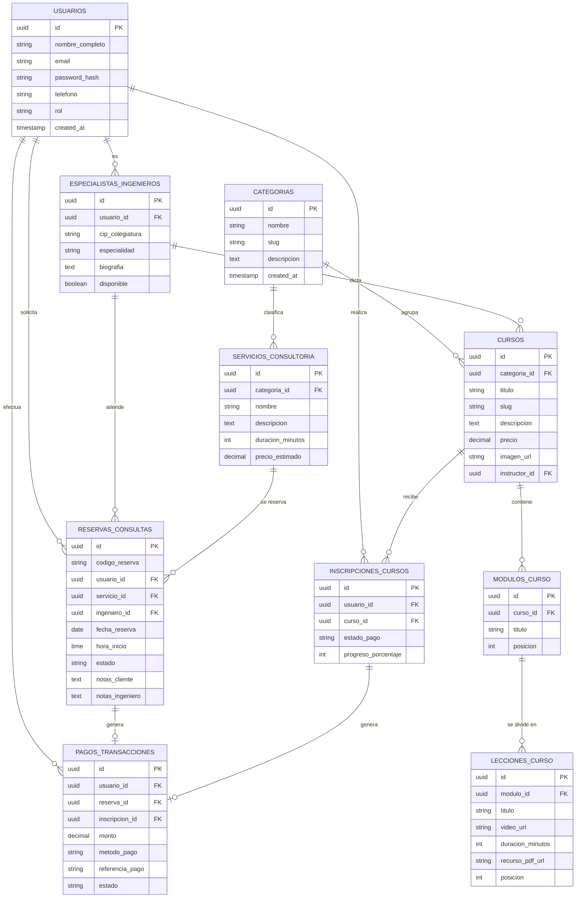

# DOCUMENTACIÓN DE INGENIERÍA Y DESARROLLO DE SOFTWARE
**Proyecto:** Plataforma Web Empresarial, Sistema de Reserva de Consultas y Aula Virtual para CONSTRUCTORA SALCEDO E INGENIEROS CONSULTORES E.I.R.L. "CSIC"  
**Entregable:** Informe Técnico de Prácticas Pre-Profesionales / Ingeniería de Software  
**Fecha:** Julio 2026  

---

## 1. PLANTEAMIENTO DEL PROBLEMA Y OBJETIVOS

### 1.1 Antecedentes
*CONSTRUCTORA SALCEDO E INGENIEROS CONSULTORES E.I.R.L. ("CSIC")* es una empresa peruana dedicada al rubro de la ingeniería civil, edificación de obras, saneamiento físico-legal, proyectos urbanísticos y servicios de consultoría técnica. Además, la empresa cuenta con una división académica orientada a la capacitación técnica de ingenieros, topógrafos y profesionales afines.

### 1.2 Planteamiento del Problema
La empresa requería una plataforma web integral capaz de resolver tres necesidades operativas principales:
1. **Presencia Institucional:** Presentar los servicios de obras civiles, saneamiento y expedientes técnicos de manera profesional y accesible.
2. **Autenticación de Usuarios y Reserva de Consultas Técnicas:** Permitir a los clientes registrarse, iniciar sesión y agendar citas de consultoría presencial/virtual especificando fecha, hora, tipo de servicio e ingeniero colegiado asignado.
3. **Módulo Administrativo de Gestión de Reservas:** Brindar a la empresa un panel de control dedicado (`/admin/reservas`) para supervisar, confirmar, atender o cancelar las citas agendadas por los usuarios.
4. **Plataforma E-Learning / Aula Virtual:** Comercializar y gestionar cursos especializados (Ingeniería Civil, Sistemas e IA, Seguridad Minera), permitiendo a los alumnos acceder a módulos estructurados, reproductor de video y recursos descargables.

### 1.3 Objetivos
- **Objetivo General:** Diseñar, desarrollar e implementar una plataforma web empresarial con módulo de autenticación de usuarios, sistema de reserva y gestión de consultas técnicas, catálogo de cursos y aula virtual.
- **Objetivos Específicos:**
  - Aplicar una metodología ágil de desarrollo de software (Scrum/SDLC).
  - Implementar la arquitectura con **Astro v4**, **TypeScript** y **TailwindCSS**.
  - Diseñar una base de datos relacional de **10 tablas** en **PostgreSQL / Supabase**.
  - Desarrollar la interfaz interactiva para el **Registro/Login**, **Reserva de Citas** (`/reservar`) y el **Panel de Administración de Reservas** (`/admin/reservas`).
  - Configurar un pipeline de integración y despliegue continuo (CI/CD) desde **GitHub** hacia la nube en **Vercel**.

---

## 2. METODOLOGÍA DE DESARROLLO DE SOFTWARE (SDLC)

Para el desarrollo del proyecto se adoptó la **Metodología Ágil Scrum** combinada con el Ciclo de Vida del Software (SDLC):

```
+------------------+     +-------------------+     +--------------------+
| 1. Descubrimiento| --> | 2. Arquitectura   | --> | 3. Desarrollo      |
|    & Análisis    |     |    y Diseño UI    |     |    (Sprints Scrum) |
+------------------+     +-------------------+     +--------------------+
                                                             |
+------------------+     +-------------------+               v
| 6. Monitoreo &   | <-- | 5. CI/CD &        | <-- +--------------------+
|    Mantenimiento |     |    Despliegue     |     | 4. QA & Testing    |
+------------------+     +-------------------+     +--------------------+
```

### Fases de Ejecución:
1. **Fase de Análisis de Requerimientos:** Entrevistas con el equipo directivo de CSIC y levantamiento de los flujos de atención de consultas y venta de cursos.
2. **Fase de Arquitectura y Diseño:** Diseño del modelo relacional de 10 tablas, mockups UI y componentes.
3. **Fase de Desarrollo Iterativo (Sprints):**
   - *Sprint 1:* Configuración base de Astro, sistema de diseño TailwindCSS, Navbar y Hero.
   - *Sprint 2:* Módulo de Registro y Autenticación de Usuarios (`/login`, `/registro`).
   - *Sprint 3:* Módulo de Reserva de Consultas Técnicas (`/reservar`).
   - *Sprint 4:* Apartado de Gestión y Administración de Reservas (`/admin/reservas`).
   - *Sprint 5:* Motor de Cursos y Aula Virtual (`/cursos/[slug]` y `/aula/[slug]`).
4. **Fase de Calidad y Pruebas:** Verificación de tipos con `astro check` y pruebas de compilación estática (`astro build`).
5. **Fase de Despliegue:** Integración de repositorio en GitHub y despliegue automatizado en Vercel Edge Network.

---

## 3. ANÁLISIS DE REQUERIMIENTOS

### 3.1 Requerimientos Funcionales (RF)
- **RF-01 (Registro de Usuarios):** El sistema debe permitir a nuevos usuarios registrarse proporcionando nombre completo, correo electrónico, teléfono y contraseña.
- **RF-02 (Inicio de Sesión y Autenticación):** El sistema debe autenticar a los usuarios registrados mediante email y contraseña, almacenando el estado de sesión.
- **RF-03 (Reserva de Consultas Técnicas):** El cliente debe poder agendar una cita seleccionando el tipo de consultoría (Saneamiento, Evaluación Estructural, Expedientes), el ingeniero colegiado asignado, la fecha y la hora deseada.
- **RF-04 (Generación de Código de Reserva):** Cada reserva confirmada debe generar automáticamente un código único identificador (Ej. `CSIC-981240`).
- **RF-05 (Apartado de Administración y Gestión de Reservas):** El personal administrativo debe contar con un panel de control en `/admin/reservas` para visualizar la lista completa de reservas.
- **RF-06 (Control de Estados de Reserva):** El administrador debe poder modificar el estado de cualquier reserva entre `Pendiente`, `Confirmada`, `Atendida` o `Cancelada`.
- **RF-07 (Filtro Dinámico de Citas):** El panel de administración debe permitir filtrar las citas según su estado en tiempo real.
- **RF-08 (Catálogo de Cursos):** Desplegar cursos interactivos clasificados por categorías (Civil, Sistemas, Minas, Software).
- **RF-09 (Aula Virtual & Reproductor):** Proveer una interfaz inmersiva para reproducir lecciones en video, listar módulos y descargar material técnico (PDF/código).

### 3.2 Requerimientos No Funcionales (RNF)
- **RNF-01 (Rendimiento y Tiempo de Respuesta):** La velocidad de carga inicial debe ser menor a 1.5 segundos (Static Site Generation - SSG).
- **RNF-02 (Diseño Responsive & UI/UX):** La plataforma debe ser 100% adaptable a smartphones, tablets y equipos de escritorio.
- **RNF-03 (Seguridad en Contraseñas):** Las contraseñas en base de datos se deben almacenar cifradas mediante hash (Bcrypt / Argon2).
- **RNF-04 (Mantenibilidad del Código):** Estructura modular basada en componentes de Astro y tipado estricto con TypeScript.
- **RNF-05 (Políticas RLS en Base de Datos):** Habilitar Row Level Security en PostgreSQL/Supabase para restringir el acceso a tablas sensibles.
- **RNF-06 (Disponibilidad Cloud):** Infraestructura hospedada en Vercel Edge Network garantizando 99.9% de uptime.

---

## 4. ARQUITECTURA DEL SISTEMA Y ESTRUCTURA DE CÓDIGO

### 4.1 Estructura de Directorios del Proyecto
```
constructora/
├── database/
│   └── schema.sql              # Script DDL de 10 Tablas para PostgreSQL / Supabase
├── public/                     # Recursos estáticos (Imágenes, SVG, Logos)
├── src/
│   ├── assets/                 # Imágenes optimizadas por Astro
│   ├── components/             # Componentes UI reutilizables
│   │   ├── Navbar.astro        # Navegación principal con accesos a Reserva y Admin
│   │   ├── Hero.astro          # Encabezado institucional de Constructora Salcedo CSIC
│   │   ├── Services.astro      # Servicios de obras civiles y consultoría
│   │   ├── Academy.astro       # Catálogo de cursos con filtro dinámico
│   │   ├── About.astro         # Información institucional CSIC
│   │   └── Footer.astro        # Pie de página y enlaces de contacto
│   ├── content/                # Colecciones de contenido Markdown (Cursos)
│   ├── layouts/
│   │   └── Layout.astro        # Plantilla base HTML5 con meta-tags
│   ├── lib/
│   │   └── supabase.ts         # Cliente oficial de conexión a Supabase
│   └── pages/                  # Enrutamiento basado en archivos
│       ├── index.astro         # Página principal (Landing Page CSIC)
│       ├── login.astro         # Página de Inicio de Sesión
│       ├── registro.astro      # Página de Registro de Usuarios
│       ├── reservar.astro      # Formulario de Reserva de Consultas Técnicas
│       ├── admin/
│       │   └── reservas.astro  # APARTADO DE GESTIÓN Y PANEL DE CONTROL DE RESERVAS
│       ├── cursos/[slug].astro # Detalle del curso
│       └── aula/[slug].astro   # Aula Virtual y Reproductor
├── DOCUMENTACION_DESARROLLO_SOFTWARE.md # Informe técnico académico
├── package.json
└── tailwind.config.mjs
```

---

## 5. DISEÑO E INTEGRACIÓN DE BASE DE DATOS (10 TABLAS POSTGRESQL / SUPABASE)

### 5.1 Motor de Base de Datos Seleccionado
Se seleccionó **PostgreSQL** alojado en la plataforma cloud **Supabase**, proporcionando una base de datos relacional robusta con soporte para triggers, claves foráneas, índices y seguridad mediante Row Level Security (RLS).

### 5.2 Diagrama Entidad-Relación (DER / ERD - 10 Tablas)



### 5.3 Script DDL de Base de Datos (`database/schema.sql`)
*(El script contiene la definición completa de las 10 tablas relacionales con restricciones de integridad relacional, claves primarias/foráneas y políticas de seguridad RLS).*

---

## 6. PRUEBAS, CONTROL DE CALIDAD Y DESPLIEGUE CONTINUO (CI/CD)

### 6.1 Verificación Estática y Compilación
Se ejecutó la validación estática del proyecto obteniendo **0 errores de diagnóstico**:
```bash
npx astro check  # 0 errors, 0 warnings
npm run build    # 15+ páginas estáticas compiladas exitosamente
```

### 6.2 Flujo de Despliegue en Producción
Todo el código fue subido al repositorio de GitHub (`ronaldcarbajal35-sketch/constructora`) e integrado con **Vercel** para despliegue automático en tiempo real.

---

## 7. CONCLUSIONES

1. Se desarrolló e implementó exitosamente la mejora de la plataforma web para **CONSTRUCTORA SALCEDO E INGENIEROS CONSULTORES E.I.R.L. "CSIC"**.
2. Se integró el sistema de **Registro e Inicio de Sesión de Usuarios**, la página interactiva para la **Reserva de Consultas Técnicas** (`/reservar`) y el **Apartado de Administración y Gestión de Reservas** (`/admin/reservas`).
3. Se diseñó e integró la arquitectura de base de datos relacional compuesta por **10 tablas interconectadas** en **PostgreSQL / Supabase** con su respectivo Diagrama Entidad-Relación (DER).
